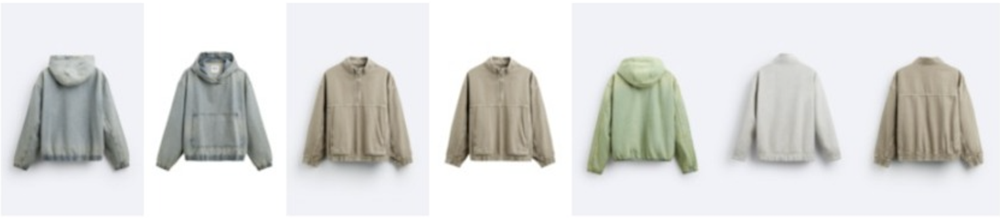
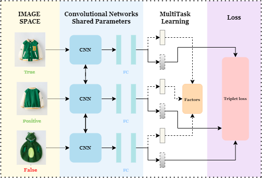
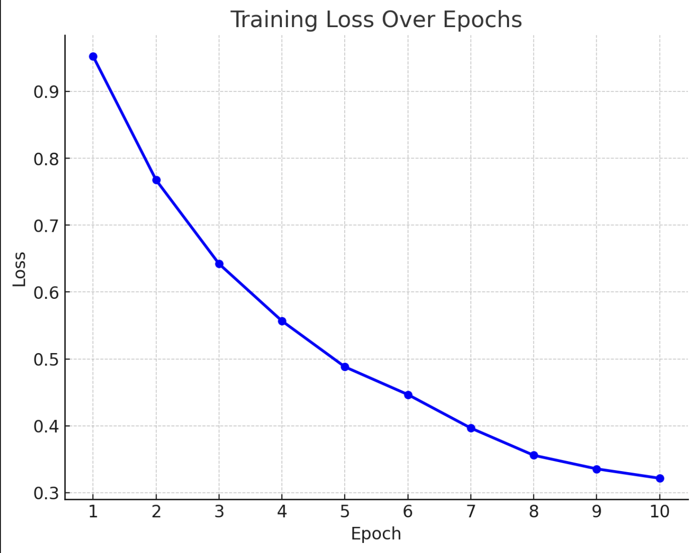
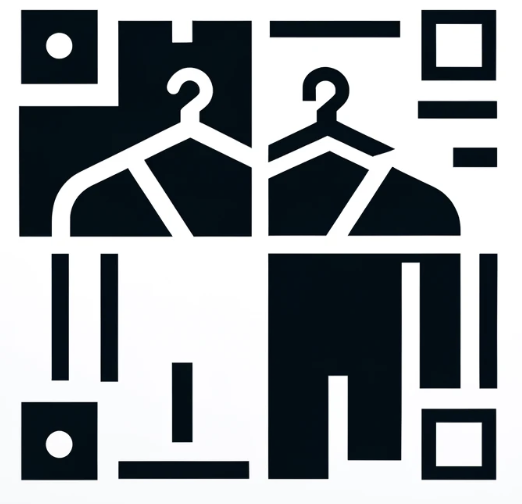

<p align="center">
    
</p>


# Py AI-Driven Clothing Similarity: Enhancing Fashion Ecommerce

## Team Members
- Julia Orteu
- Elena Alegret
- Joan Saurina
- Sergi Tomas

## Overview
Our project aims to identify duplicates and similarities within a dataset of approximately 140,000 fashion images. This is part of the Inditex Hackathon Challenge 2024, where precision, efficiency, scalability, and solution completeness are crucial criteria.

## Objective
The goal is to design an algorithm capable of finding similar clothing images, effectively identifying visual duplicates or near-duplicates. This can streamline e-commerce data management and provide more accurate recommendations for users.

## The Challenge
The computational challenge involves comparing tens of thousands of images, which results in billions of comparisons. We use open-source AI algorithms, state-of-the-art technologies, and deep learning methods to tackle this challenge.

### Requirements and Rules
- Open-source algorithms and models preferred.
- Python is the recommended programming language.
- Solutions will be evaluated based on precision, efficiency, scalability, and presentation quality.

  
## Key Features
1. **Deep Learning-Based Fashion Search**: Inspired by the "Tiered Deep Similarity Search for Fashion" framework, our solution utilizes deep metric learning and multi-task CNNs to create an attribute-guided metric learning model that efficiently identifies clothing similarity.

2. **Attribute-Guided Metric Learning (AGML)**: Incorporates multiple similarity tiers for fashion search based on categories, brands, and styles.

3. **Efficient Workflow**: The solution employs a structured workflow that includes downloading data, defining similarity criteria, training the algorithm, inference, and visualization.

## Workflow
1. **Download Data**: Accesses the dataset containing over 140,000 fashion images with varying angles and perspectives.
2. **Define Similarity Criteria**: Incorporates color, shapes, textures, patterns, and embeddings.
3. **Find and Train Algorithm**: Uses a triplet-based network for learning discriminative feature embeddings.
4. **Inference**: Identifies similarities based on learned embeddings.
5. **Visualization**: Provides visual results via a dashboard.
<p align="center">
    
    
</p>

<p align="center">
    <em>Figure 1: Similarity Network Architecture Diagram</em>
    <em>Figure 2: Loss Model Curve</em> &emsp;&emsp;&emsp;&emsp;&emsp;
</p>


## Our Application: Item Gallery
This project features a dashboard that demonstrates the results of our model's implementation. The dashboard was built using Streamlit and can be launched from the `app` directory.
### Instructions:
1. **Navigate to the Application Directory**  
   Go to the `app` directory where the application files are stored:
   ```bash
   cd app
   ```
2. **Launch the Dashboard**  
   Run the following command to launch the Streamlit application:
   ```bash
   streamlit run app.py
   ```
   
## Requirements
To set up the required dependencies for this project, ensure you have Python installed and run:
```bash
pip install -r requirements.txt
```

#### Accessing Data and Model Weights
⚠️ In case access to the dataset or trained model weights is required, please reach out to the contributors directly. Alternatively, you may retrain the model by executing the provided code. The team will provide guidance for these steps if needed.
<p align="center">
    
</p>

